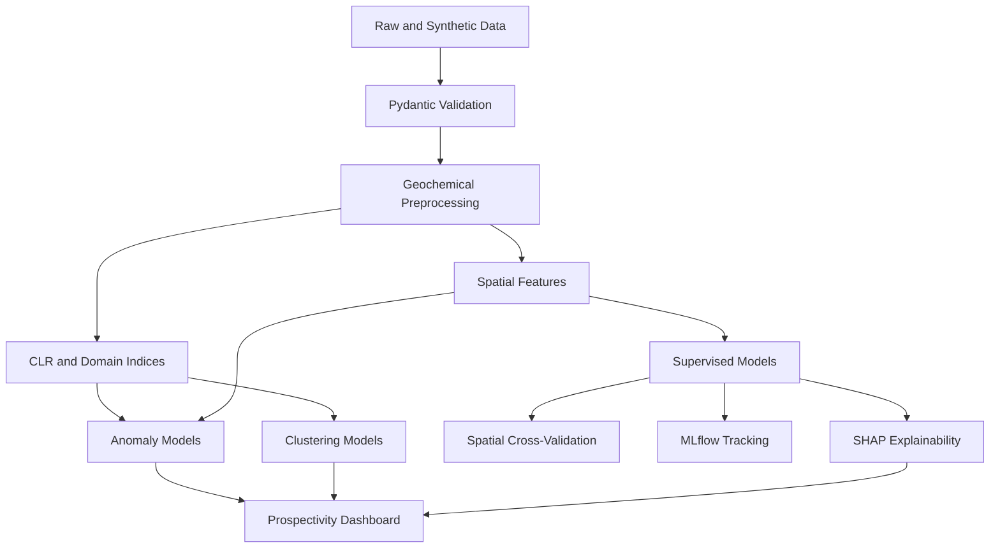

# AUREO-ML

**Auriferous Exploration & Mineral Characterization with Machine Learning**

[](https://www.python.org/)
[](LICENSE)
[](.github/workflows/ci.yml)
[](pyproject.toml)
[](app/streamlit_app.py)

```
       AUREO-ML
  Au + As + Sb + Spatial AI
  Gold exploration signals from geochemistry, geology, and machine learning
```

Author: **Diego F. Pulido Sastoque**  
Email: **dfpulidos@unal.edu.co**  
LinkedIn: <https://www.linkedin.com/in/diego-f-pulido-sastoque-91081b14a>

## Why This Project Matters

Gold exploration is capital intensive. A traditional campaign may spend millions of dollars on regional sampling, trenching, geophysics, and drilling before proving that a target has sufficient grade, continuity, metallurgy, and scale. Many prospects never become mines. Multi-element geochemical datasets contain weak, non-linear, and spatially structured signals that classical threshold maps often fail to combine.

AUREO-ML demonstrates a reproducible machine-learning workflow for auriferous exploration. It identifies geochemical anomalies, classifies prospectivity, predicts gold grade, explains pathfinder controls, and presents results as interactive maps that can support exploration decisions.

This repository is designed as a scientific portfolio project at the intersection of geology, mineral exploration, geochemistry, GIS, and applied AI.

## Core Capabilities

- Synthetic geochemical dataset with 10,000 Antioquia samples.
- Fifteen elements: Au, Ag, As, Sb, Cu, Pb, Zn, Fe, Mn, Hg, Bi, Te, Mo, W, S.
- Compositional data workflow with centered log-ratio transformation.
- Anomaly detection with Isolation Forest, Local Outlier Factor, One-Class SVM, and Mahalanobis distance.
- Population detection with K-Means, DBSCAN, and Gaussian Mixture Models.
- Spatial cross-validation for geospatial autocorrelation control.
- Supervised classification for prospective versus non-prospective zones.
- Au grade regression scaffold for g/t prediction.
- MLflow experiment tracking.
- SHAP-ready explainability workflow.
- Multi-page Streamlit dashboard with folium maps and live prediction.

## Business Problem

Traditional exploration often uses single-element thresholds, expert-drawn contours, and local geological judgment. Those remain essential, but they can underuse high-dimensional geochemistry. AUREO-ML adds multivariate learning to rank targets and make exploration decisions more transparent.

| Exploration Task | Traditional Approach | AUREO-ML Approach |
|---|---|---|
| Anomaly definition | Percentile thresholds per element | Multivariate anomaly consensus |
| Pathfinder interpretation | Manual bivariate plots | CLR, ratios, SHAP, permutation importance |
| Validation | Random or campaign split | Spatial GroupKFold |
| Target ranking | Expert polygons | Probabilistic prospectivity score |
| Communication | Static maps | Interactive dashboard |
| Reproducibility | Spreadsheet workflows | Tested Python package and Makefile |

## Architecture



## Repository Layout

```text
aureo-ml/
├── app/                         # Streamlit dashboard
├── data/                        # raw, processed, external, synthetic data
├── docs/                        # scientific methodology and references
├── notebooks/                   # executable research notebooks
├── reports/                     # compact PDF reports
├── src/aureo_ml/                # production Python package
├── tests/                       # pytest suite
├── Makefile                     # setup, data, train, app, test
├── pyproject.toml               # package, lint, test, mypy config
└── README.md
```

## Quickstart

```bash
make setup
make data
make train
make test
make app
```

Manual equivalent:

```bash
python -m pip install -e ".[dev]"
python -m aureo_ml.data.synthetic_generator --samples 10000 --output data/synthetic/antioquia_geochemistry.csv
python -m aureo_ml.models.ensemble --input data/synthetic/antioquia_geochemistry.csv --output models/aureo_stacking.joblib
streamlit run app/streamlit_app.py
```

## Expected Benchmark Results

Synthetic benchmark metrics are deterministic but depend on installed library versions and CPU-level numerical details. Typical values:

| Model | Validation | Metric | Expected |
|---|---|---:|---:|
| Random Forest classifier | Spatial CV | AUC | > 0.90 |
| Random Forest classifier | Spatial CV | F1 | > 0.80 |
| Stacking classifier | Holdout | AUC | > 0.92 |
| Au grade regressor | Holdout | RMSE | low relative to log-Au spread |
| Anomaly consensus | Top 10% | Discovery efficiency | > 0.65 |

## Scientific Design

The generator simulates real exploration behavior: log-normal concentrations, clustered sampling near districts, district-scale mineralized centers, structural corridor effects, lithological fertility, depth attenuation, and pathfinder covariation.

The compositional workflow is critical. Geochemical vectors are positive and often interpreted as parts of a chemical system. Direct Pearson correlation on raw parts can be misleading because closure and skewness distort relationships. AUREO-ML includes centered log-ratio transformation and robust log transforms.

Spatial validation is equally critical. Nearby samples share geology and sampling bias. Random K-Fold leaks spatial information and can overstate predictive performance. AUREO-ML includes deterministic spatial blocks and GroupKFold splitting.

## Dashboard

The Streamlit app includes:

- overview metrics,
- filters by minimum Au grade, depth, and potential class,
- folium prospectivity map,
- Au-As-Sb exploratory plots,
- live prediction from user-entered geochemical values,
- fast contribution proxy in the UI,
- notebook-based SHAP workflow for full explanations.

Screenshot path for portfolio use:

```text
reports/figures/dashboard_screenshot.png
```

The app can generate demo data on the fly, so a reviewer can run it without downloading external datasets.

## External Data Sources

The repository is prepared for:

- USGS Mineral Resources Online Spatial Data: <https://mrdata.usgs.gov/>
- Servicio Geológico Colombiano Datos Abiertos.

The included pipeline uses synthetic data by default for reproducibility and to avoid redistributing third-party data.

## Notebooks

1. `01_data_generation.ipynb`: synthetic Antioquia geochemistry.
2. `02_eda_geochemistry.ipynb`: EDA, CLR, ternary diagrams, correlations, mixtures.
3. `03_anomaly_detection.ipynb`: Isolation Forest, LOF, One-Class SVM, Mahalanobis.
4. `04_clustering_analysis.ipynb`: K-Means, DBSCAN, GMM.
5. `05_supervised_modeling.ipynb`: classification and spatial CV.
6. `06_explainability.ipynb`: SHAP analysis.
7. `07_geospatial_mapping.ipynb`: folium prospectivity mapping.

## Quality Gates

- Python 3.11+
- Type hints on public package functions.
- Google-style docstrings.
- Pytest with coverage threshold.
- Black, Ruff, and mypy configuration.
- Pre-commit hooks.
- Fixed random seeds.
- Docker and docker-compose support.

## Selected References

This project follows ideas from mineral prospectivity mapping, compositional data analysis, anomaly detection, and explainable ML. Key references include Aitchison on compositional data, Carranza on GIS mineral prospectivity, Rodriguez-Galiano et al. on ML for mineral prospectivity, Zuo and Carranza on support-vector mineral prospectivity mapping, Lundberg and Lee on SHAP, Breiman on random forests, Chen and Guestrin on XGBoost, Ke et al. on LightGBM, Prokhorenkova et al. on CatBoost, and Goldfarb/Groves/Sillitoe on mineral deposit context.

Full BibTeX file: [`docs/references.bib`](docs/references.bib)

## How To Publish

```bash
git init
git add .
git commit -m "Initial AUREO-ML portfolio project"
git branch -M main
git remote add origin https://github.com/dfpulidos/aureo-ml.git
git push -u origin main
```

---

# AUREO-ML en Español

**Exploración Aurífera y Caracterización Mineral con Machine Learning**

## Por Qué Importa

La exploración aurífera requiere decisiones bajo incertidumbre. Los equipos técnicos deben priorizar blancos con información incompleta, datos geoquímicos sesgados, autocorrelación espacial, múltiples poblaciones de fondo y anomalía, y controles estructurales difíciles de modelar con reglas simples.

AUREO-ML convierte datos geoquímicos multi-elemento en evidencia reproducible: anomalías multivariadas, clases de prospectividad, predicción de ley de oro, mapas interactivos y explicaciones de variables guía.

## Problema de Negocio

El objetivo es reducir riesgo exploratorio. El sistema no reemplaza cartografía, geología estructural, QA/QC ni perforación. Sirve para priorizar zonas y comunicar por qué un blanco merece trabajo de campo adicional.

## Capacidades

- Generación de datos sintéticos realistas para Antioquia.
- 15 elementos químicos usados en exploración aurífera.
- Transformación CLR para datos composicionales.
- Modelos de anomalías y clustering.
- Clasificación de potencial alto, medio y bajo.
- Validación cruzada espacial.
- Seguimiento con MLflow.
- Dashboard profesional en Streamlit.

## Flujo Técnico

1. Validar datos con Pydantic.
2. Transformar concentraciones con log y CLR.
3. Crear índices Au/Ag, As/Sb, epithermal pathfinder, intrusion-related y sulfide proxy.
4. Crear features espaciales y bloques de validación.
5. Entrenar modelos de anomalía, clustering, clasificación y regresión.
6. Evaluar con métricas de ML y métricas mineras.
7. Explicar con SHAP y permutation importance.
8. Desplegar mapa y predicción viva en Streamlit.

## Comandos

```bash
make setup
make data
make train
make test
make app
```

## Resultados Esperados

En el benchmark sintético, los modelos capturan señales Au-As-Sb-Hg-Te porque el generador codifica controles geológicos realistas. El objetivo del proyecto no es afirmar un descubrimiento real, sino demostrar un flujo robusto, auditable y geocientíficamente defendible.

## Limitaciones

- Los datos sintéticos no sustituyen ensayos certificados.
- Las coordenadas son realistas a escala regional, no permisos mineros reales.
- Los modelos dependen de la calidad del muestreo y del control geológico.
- Las explicaciones SHAP indican asociaciones estadísticas, no causalidad geológica automática.
- Todo blanco requiere validación de campo.

## Trabajo Futuro

- Integrar datos reales del SGC.
- Descargar capas USGS MRDS y armonizarlas.
- Agregar geofísica regional.
- Agregar litología y fallas oficiales.
- Entrenar modelos jerárquicos por dominio geológico.
- Exportar prospectividad a GeoPackage.
- Agregar incertidumbre bayesiana.
- Agregar costo de perforación y optimización de campañas.

## Technical Appendix / Apéndice Técnico

001. Au is modeled as a highly skewed economic variable.
002. As is modeled as a gold pathfinder.
003. Sb is modeled as a gold pathfinder.
004. Ag supports precious-metal association.
005. Hg supports epithermal and volatile signatures.
006. Te supports telluride and intrusion-related signatures.
007. Bi supports intrusion-related affinity.
008. W supports intrusion-related affinity.
009. Mo supports intrusion-related affinity.
010. Cu, Pb, and Zn support base-metal zoning.
011. Fe and S support sulfide proxy interpretation.
012. Mn supports weathering and lithogeochemical context.
013. Log-normal distributions represent positive skew.
014. Mixture populations represent background and anomaly domains.
015. Spatial clustering represents preferential exploration sampling.
016. Structural score represents corridor proximity.
017. Alteration intensity represents hydrothermal footprint.
018. Lithology factor represents fertility differences.
019. Depth attenuation represents near-surface sampling effect.
020. Fixed seeds support reproducibility.
021. Pydantic validation catches impossible coordinates.
022. Pydantic validation catches negative assays.
023. GeoDataFrame conversion supports GIS export.
024. Folium supports browser-based prospectivity review.
025. Plotly supports interactive geochemical diagnostics.
026. Streamlit supports fast stakeholder delivery.
027. MLflow supports experiment audit trails.
028. Pytest supports scientific software confidence.
029. Ruff supports static code quality.
030. Black supports consistent formatting.
031. Mypy supports type-contract discipline.
032. Docker supports portable execution.
033. Makefile supports reproducible command flow.
034. CI supports automated validation.
035. MIT license supports reuse with attribution.
036. Citation metadata supports scientific credit.
037. Spatial CV reduces leakage from neighboring samples.
038. Random K-Fold can overestimate performance.
039. GroupKFold on spatial blocks is conservative.
040. Discovery efficiency measures exploration usefulness.
041. AUC measures ranking power.
042. F1 measures thresholded classification balance.
043. Average precision measures rare-target ranking.
044. RMSE measures Au grade error.
045. SHAP supports local explanation.
046. Permutation importance supports global feature checking.
047. PDP supports response-shape inspection.
048. Isolation Forest detects sparse multivariate anomalies.
049. LOF detects local-density outliers.
050. One-Class SVM detects boundary-based novelty.
051. Mahalanobis distance detects covariance-scaled extremes.
052. K-Means separates broad geochemical domains.
053. GMM models overlapping populations.
054. DBSCAN finds dense clusters and noise.
055. Random Forest handles non-linear thresholds.
056. XGBoost is suited to tabular ranking.
057. LightGBM is suited to efficient boosting.
058. CatBoost handles categorical variables robustly.
059. Stacking combines complementary learners.
060. Optuna is prepared for hyperparameter tuning.
061. CLR removes row-wise compositional center.
062. Multiplicative replacement avoids log zero issues.
063. Au/Ag ratio supports precious-metal zoning.
064. As/Sb ratio supports pathfinder balance.
065. Epithermal index combines As, Sb, Hg, and Te.
066. Intrusion-related index combines Bi, Te, W, and Mo.
067. Sulfide proxy combines S with Fe, Cu, Pb, and Zn.
068. Neighbor density captures sampling intensity.
069. Coordinate interaction captures broad spatial trend.
070. Antioquia bounds keep samples in target region.
071. Segovia-Remedios center anchors a gold district.
072. Amalfi-Anori center anchors a gold trend.
073. Buritica center anchors a gold belt.
074. Nordeste Antioqueno center anchors a regional target zone.
075. Synthetic data is not a resource estimate.
076. Synthetic data is not a reserve statement.
077. Synthetic data is not a claim recommendation.
078. Synthetic data demonstrates methods.
079. Real deployment requires QA/QC.
080. Real deployment requires duplicate analysis.
081. Real deployment requires blanks and standards.
082. Real deployment requires coordinate audit.
083. Real deployment requires sample-media metadata.
084. Real deployment requires lithological mapping.
085. Real deployment requires structural interpretation.
086. Real deployment requires regulatory review.
087. Model output should guide field validation.
088. Model output should not replace geological reasoning.
089. High probability means statistical similarity to learned targets.
090. Low probability can still hide blind deposits.
091. Pathfinder enrichment must be interpreted by deposit model.
092. Weathering can remobilize elements.
093. Transported cover can mask bedrock signal.
094. Nugget effect can distort Au assays.
095. Censored assays need specialized treatment in real data.
096. Laboratory batches can introduce bias.
097. Unit harmonization is mandatory.
098. Coordinate reference systems must be explicit.
099. Streamlit app prioritizes exploration workflow.
100. Notebook workflow prioritizes scientific audit.
101. English section supports global reviewers.
102. Spanish section supports Colombian context.
103. Documentation links business value to technical choices.
104. References ground the workflow in published science.
105. Tests protect key assumptions.
106. Coverage target prevents demo-only code.
107. Pre-commit prevents style drift.
108. CI prevents broken portfolio state.
109. Data directories keep raw and synthetic data separate.
110. Model directory stores trained artifacts.
111. Report directory stores figures and PDF summaries.
112. App directory stores stakeholder interface.
113. Src directory stores reusable library code.
114. Tests directory stores regression checks.
115. Docs directory stores scientific interpretation.
116. Notebooks directory stores exploratory narrative.
117. Requirements pin versions for reproducibility.
118. Pyproject defines package metadata.
119. Dockerfile supports deployment.
120. Docker Compose supports local service run.
121. Regional background must be separated from district anomaly.
122. Thresholds should be domain-specific when lithologies differ.
123. Percentile cutoffs are useful but incomplete.
124. Multivariate scores capture element associations.
125. Pathfinder association can vary by deposit style.
126. Orogenic systems often show strong structural control.
127. Epithermal systems often show volatile pathfinders.
128. Intrusion-related systems can show Bi-Te-W-Mo affinity.
129. Base-metal halos can represent zoning.
130. Sulfide proxies require mineralogical confirmation.
131. Geochemistry should be reviewed with maps.
132. Geochemistry should be reviewed with geology.
133. Geochemistry should be reviewed with sample medium.
134. Soil samples differ from rock chips.
135. Stream sediment samples differ from soils.
136. Drainage catchments can mix sources.
137. Rock chips can be biased toward visible mineralization.
138. Assay detection limits affect low-end distributions.
139. Upper detection limits affect extreme anomalies.
140. Replacement values should be documented.
141. Robust scaling reduces extreme-value dominance.
142. Log transforms reduce skew.
143. CLR transforms support compositional interpretation.
144. Raw-space plots remain useful for field communication.
145. Ternary plots show relative pathfinder balance.
146. Heat maps show correlation structure.
147. Correlations do not prove shared mineral source.
148. Mixture models help separate populations.
149. GMM components require geological review.
150. DBSCAN noise can highlight unusual samples.
151. K-Means clusters are sensitive to scaling.
152. Mahalanobis distance assumes covariance structure.
153. Isolation Forest handles high-dimensional sparse anomaly.
154. LOF handles local neighborhood rarity.
155. One-Class SVM depends on nu and gamma.
156. Consensus anomaly reduces method-specific bias.
157. Prospectivity score should be calibrated before decisions.
158. Probability maps should show uncertainty.
159. Model training should preserve blind spatial blocks.
160. Hyperparameter tuning should use spatial folds.
161. Optuna objective should optimize exploration metric.
162. AUC alone can hide poor top-target precision.
163. Average precision is useful for rare positives.
164. Recall at top area is useful for targeting.
165. Precision at top area is useful for budget planning.
166. Discovery efficiency links ML ranking to field work.
167. Cost-sensitive metrics can include drilling cost.
168. Future versions can optimize meters drilled per discovery.
169. Feature leakage can occur through derived target proxies.
170. Target labels must be defined before feature engineering.
171. Spatial duplicates should be handled carefully.
172. Duplicate assays can estimate analytical variance.
173. Field duplicates can estimate sampling variance.
174. Coarse coordinates can blur spatial validation.
175. CRS transformations must preserve geometry.
176. EPSG:4326 is used for web maps.
177. Projected CRS is preferred for distance analysis.
178. Haversine distance approximates regional neighbor spacing.
179. BallTree supports efficient geodesic neighbors.
180. Folium uses web mercator tiles.
181. Rasterio is included for raster prospectivity extensions.
182. Shapely is included for geometry operations.
183. GeoPandas is included for vector GIS workflows.
184. Kepler.gl is included for high-density visual analytics.
185. Plotly is included for interactive scientific plots.
186. Matplotlib remains useful for publication figures.
187. MLflow records metrics and artifacts.
188. Local MLflow folder is ignored by git.
189. Trained model artifacts are ignored by default.
190. Synthetic CSV files are ignored to keep repo light.
191. Gitkeep files preserve data structure.
192. Docker image installs geospatial system libraries.
193. Streamlit Cloud can use requirements.txt.
194. GitHub Actions validates imports and tests.
195. Deploy workflow validates app readiness.
196. Pre-commit runs before commits.
197. Scientific claims should cite sources.
198. Portfolio claims should show reproducible commands.
199. Notebook outputs should be regenerated by reviewers.
200. Dashboard should be treated as decision support.
201. Data generator encodes known exploration biases.
202. Background samples represent reconnaissance coverage.
203. Clustered samples represent follow-up campaigns.
204. Mineralized centers represent district-scale fertility.
205. Structural corridors represent permeability and fluid flow.
206. Lithology terms are simplified for demo clarity.
207. Depth variable approximates sampling and drilling context.
208. Potential class is derived from continuous prospectivity.
209. Binary target supports supervised classification.
210. Continuous Au supports regression.
211. Au values are reported as g/t.
212. Most other elements are reported as ppm-like values.
213. Fe and S are large-scale proxies in the simulation.
214. Real Fe may be percent and needs unit harmonization.
215. Real S may be percent and needs unit harmonization.
216. Pathfinders should be reviewed by analytical package.
217. Assay digestion method affects comparability.
218. Fire assay and ICP methods differ by element.
219. QA/QC failures should be excluded or flagged.
220. Missing data should use geochemically defensible imputation.
221. Imputation uncertainty should be tracked.
222. Censored data can use robust substitution or survival models.
223. Outlier removal can delete discoveries if careless.
224. Anomaly detection should rank before discard.
225. Extreme Au should be checked, not automatically removed.
226. Sample metadata is part of the feature space.
227. Campaign metadata can expose sampling bias.
228. Temporal metadata can expose lab batch effects.
229. Spatial block size should match exploration scale.
230. Too-small blocks leak spatial signal.
231. Too-large blocks reduce training diversity.
232. Fold maps should be inspected visually.
233. Train-test splits should be saved for audit.
234. Model cards should document intended use.
235. Limitations should be explicit.
236. Future work should be technically actionable.
237. Reproducibility includes software versions.
238. Reproducibility includes seeds.
239. Reproducibility includes data-generation logic.
240. Reproducibility includes environment variables.
241. Reproducibility includes model artifacts.
242. Scientific reporting includes assumptions.
243. Scientific reporting includes uncertainty.
244. Scientific reporting includes limitations.
245. Scientific reporting includes references.
246. Scientific reporting includes methods.
247. Scientific reporting includes results.
248. Scientific reporting includes interpretation.
249. Scientific reporting includes future work.
250. Bilingual reporting increases accessibility.
251. English supports international portfolio review.
252. Spanish supports local technical stakeholders.
253. Clear commands reduce reviewer friction.
254. Clean structure improves maintainability.
255. Small modules improve testability.
256. Public functions include type hints.
257. Public functions include docstrings.
258. Examples in docstrings support quick checks.
259. Unit tests protect numerical assumptions.
260. Integration tests can be added for full pipeline.
261. Notebook smoke tests can be added in CI.
262. App smoke tests can be added with Playwright.
263. Static type checks reduce interface errors.
264. Linting reduces accidental complexity.
265. Formatting reduces review noise.
266. Domain indices encode geological priors.
267. ML models learn residual nonlinear structure.
268. Explainability reconnects model output to geology.
269. Local SHAP explains individual target ranking.
270. Global SHAP explains dominant controls.
271. PDP shows marginal response curves.
272. ICE curves can show local response variation.
273. Permutation importance checks model reliance.
274. Stability analysis can compare folds.
275. Bootstrap can quantify uncertainty.
276. Calibration curves can evaluate probabilities.
277. Isotonic calibration can adjust probabilities.
278. Platt scaling can adjust probabilities.
279. Confusion matrices support threshold choice.
280. Threshold choice should match exploration budget.
281. High recall supports early-stage reconnaissance.
282. High precision supports expensive drilling.
283. Balanced F1 supports general ranking.
284. Cost curves can support campaign design.
285. Drill targeting needs geological constraints.
286. Environmental constraints should be integrated.
287. Land tenure should be integrated.
288. Access constraints should be integrated.
289. Community constraints should be integrated.
290. Protected areas should be integrated.
291. Regulatory constraints should be integrated.
292. Model output alone is insufficient for permitting.
293. Model output alone is insufficient for reserve reporting.
294. Resource estimation needs drilling and geostatistics.
295. Prospectivity mapping precedes resource estimation.
296. Geostatistics can be added after drilling.
297. Kriging can model grade continuity.
298. Simulation can model grade uncertainty.
299. This project focuses on pre-drilling targeting.
300. Synthetic benchmark isolates ML workflow behavior.
301. Real data integration is future-facing.
302. USGS MRDS can provide deposit occurrences.
303. SGC data can provide Colombian context.
304. Geological maps can provide lithology.
305. Fault maps can provide structural proximity.
306. DEM data can provide terrain features.
307. Remote sensing can provide alteration proxies.
308. Magnetics can provide lithostructural context.
309. Radiometrics can provide alteration context.
310. Gravity can provide basement context.
311. Multi-modal fusion is a natural extension.
312. Graph models can represent structural networks.
313. Bayesian models can encode expert priors.
314. Active learning can optimize new sampling.
315. Semi-supervised learning can use unlabeled samples.
316. Positive-unlabeled learning fits scarce deposits.
317. Imbalanced learning helps rare positives.
318. SMOTE must be used cautiously with spatial data.
319. Class weights are safer for baseline models.
320. Balanced subsampling helps random forests.
321. Rare discoveries create label scarcity.
322. Deposit absence is harder to prove than presence.
323. Negative labels may be uncertain.
324. Target labels should include confidence levels.
325. Multi-class labels can represent low, medium, high.
326. Regression labels can represent Au grade.
327. Joint models can combine classification and regression.
328. Stacking can improve rank stability.
329. Simpler models can improve trust.
330. Complex models need stronger explanation.
331. Model drift can occur when new districts are added.
332. Retraining should be versioned.
333. Dataset versions should be versioned.
334. Feature versions should be versioned.
335. Model versions should be versioned.
336. MLflow helps version experiments.
337. DVC could version large datasets later.
338. GeoPackage export could improve GIS handoff.
339. Cloud deployment could improve stakeholder access.
340. Notebook narratives support scientific review.
341. Tests support engineering review.
342. Dashboard supports executive review.
343. Documentation supports portfolio review.
344. Architecture diagram supports system review.
345. Citation file supports academic reuse.
346. License supports open-source reuse.
347. Make commands support repeatability.
348. Docker supports environment portability.
349. CI supports remote quality checks.
350. Future PRs should preserve these guarantees.
